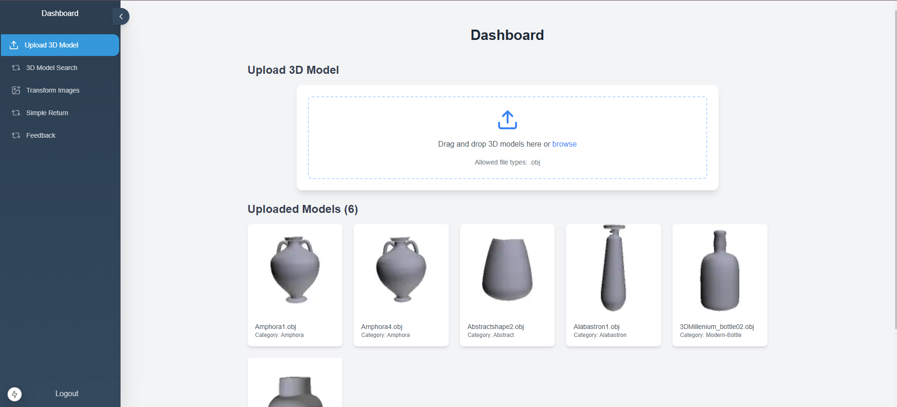
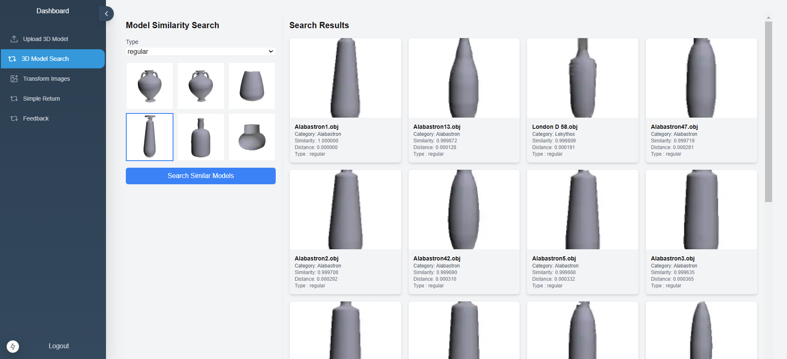
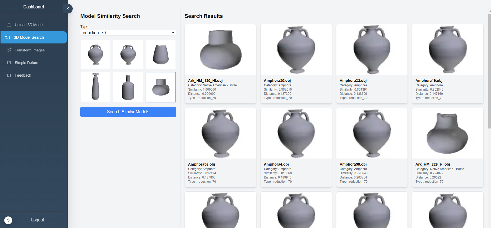

# 3D Model Retrieval System

This project involves the development of a 3D model indexing and retrieval system based on shape descriptors. The system is designed to calculate shape descriptors for a query 3D model and measure its similarity to models in a database, returning the closest matches.







## Features
- **Shape Descriptors**: Implementation of 3D Fourier coefficients and Zernike moments for compact and invariant representations of 3D models.
- **3D Model Normalization**: Ensures invariance to rotation, translation, and scaling.
- **Similarity Search**: Measures similarity using descriptors and returns the most similar models.
- **Mesh Simplification**: Evaluates performance with and without mesh reduction.
- **Web Application**: Built using Flask (backend) and React with Next.js (frontend).

## Technologies Used
- **Python**: Implementation of algorithms using libraries like `NumPy` and `SciPy`.
- **Flask**: Backend for the web application.
- **MongoDB**: Storage for 3D model data.
- **React & Next.js**: Frontend for a dynamic and performant user interface.

## How It Works

1. **Upload Models**: Upload 3D models to the system, specifying their category, thumbnail, and path.
2. **Shape Descriptor Calculation**: 
   - Compute 3D Fourier coefficients and Zernike moments for the uploaded models.
   - Normalize models to ensure invariance to rotation, translation, and scaling.
3. **Similarity Search**:
   - Select a query model and perform a similarity search.
   - Choose between searches with or without mesh reduction.
4. **Results Display**:
   - The system returns similar models with details such as name, category, similarity score, distance, and reduction type.

## Key Algorithms
### 3D Fourier Coefficients
- Represents the structure of 3D models in frequency space.
- Steps:
  1. Normalize the 3D mesh (center and scale).
  2. Apply the 3D Fourier transform.
  3. Extract magnitudes of Fourier coefficients for invariance.

### Zernike Moments
- Utilizes orthogonal Zernike polynomials for shape representation.
- Steps:
  1. Convert Cartesian coordinates to spherical coordinates.
  2. Compute Zernike polynomials for the 3D model.
  3. Normalize moments for invariance.

## Results and Analysis
- **Fourier Coefficients**: Effective for compact representation and capturing model structure.
- **Zernike Moments**: Highly precise for complex shapes.
- **Mesh Reduction**: Slight drop in performance with reduced meshes, but descriptors remain robust.

## Installation and Usage
1. Clone the repository:
   ```bash
   git clone https://github.com/amine-sabbahi/content-based-3d-search.git
   cd content-based-3d-search
2. Start the backend server:
    ```bash
    cd back-end
    python app.python
3. Start the frontend server:
    ```bash
    cd front-end
    npm run install
    npm run dev
4. Access the application at http://localhost:3000.

## Contributors


   - [Mohamed Amine Sabbahi](https://github.com/amine-sabbahi).

   - [Fatima Zahra Arichi](https://github.com/ARICHI-FZ).

   - [Aymane Mahri](https://github.com/AymaneM21).

---

**Abdelmalek Essaadi University** Faculty of Sciences and Techniques
   - Department : Computer Engineering
   - Master : AI & DS
   - Module : Multimedia Mining and Indexing
   - Framed by : Pr. M’hamed AIT KBIR